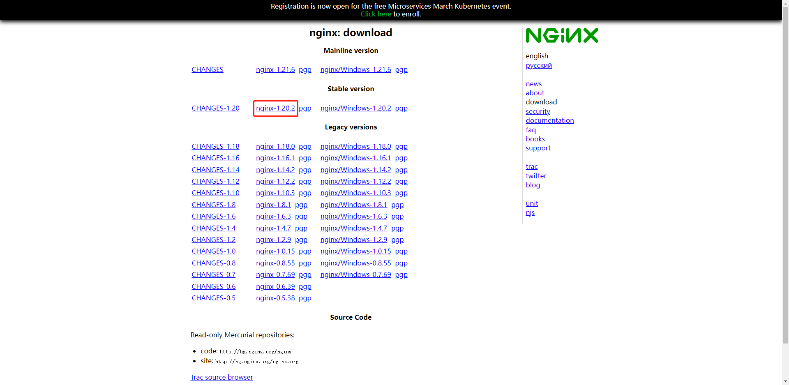

# 软件安装
[[toc]]


## 资源查看(HUAWEICLOUD)
[jdk](https://mirrors.huaweicloud.com/java/jdk/)
[maven](https://mirrors.huaweicloud.com/apache/maven/maven-3/)
[tomcat](https://mirrors.huaweicloud.com/apache/tomcat/)
[nodejs](https://mirrors.huaweicloud.com/nodejs/)
[nginx](https://mirrors.huaweicloud.com/nginx/)
[mysql](https://mirrors.huaweicloud.com/mysql/)
[redis](https://mirrors.huaweicloud.com/redis/)
[docker](https://mirrors.huaweicloud.com/docker-ce/)
[jenkins](https://mirrors.huaweicloud.com/jenkins/)

<Badge text="Git"/> <Badge text="SonarQube"/> <Badge text="CheckStyle"/>

## JDK安装
```shell script
mkdir -p /opt && cd /opt

wget https://mirrors.huaweicloud.com/java/jdk/8u202-b08/jdk-8u202-linux-x64.tar.gz

mkdir -p ./jdk1.8.0_202 && tar -zxvf jdk-8u202-linux-x64.tar.gz -C ./jdk1.8.0_202 --strip-components 1

vim /etc/profile
export JAVA_HOME=/opt/jdk1.8.0_202
export PATH=$PATH:$JAVA_HOME/bin
export CLASSPATH=.:$JAVA_HOME/lib/dt.jar:$JAVA_HOME/lib/tools.jar

source /etc/profile

java -version
```


## MAVEN安装
```shell script
mkdir -p /opt && cd /opt

wget https://mirrors.huaweicloud.com/apache/maven/maven-3/3.6.3/binaries/apache-maven-3.6.3-bin.tar.gz

mkdir -p ./apache-maven-3.6.3 && tar -zxvf apache-maven-3.6.3-bin.tar.gz -C ./apache-maven-3.6.3 --strip-components 1

vim /etc/profile
export MAVEN_HOME=/opt/apache-maven-3.6.3
export PATH=$PATH:$MAVEN_HOME/bin

source /etc/profile

mvn -version
```
::: warning

 设置MAVEN镜像：
       
       https://developer.aliyun.com/mirror/maven
       
       <mirror>
           <id>aliyunmaven</id>
           <mirrorOf>*</mirrorOf>
           <name>阿里云公共仓库</name>
           <url>https://maven.aliyun.com/repository/public</url>
       </mirror>

:::

## NODE安装
```shell script
mkdir -p /opt && cd /opt

wget https://mirrors.huaweicloud.com/nodejs/v10.16.0/node-v10.16.0-linux-x64.tar.gz

mkdir -p ./node-v10.16.0 && tar -xf node-v10.16.0-linux-x64.tar.xz -C ./node-v10.16.0 --strip-components 1

vim /etc/profile
export PATH=$PATH:/opt/node-v10.16.0/bin

source /etc/profile

node -v
npm -v
```
::: warning
 
 1.将npm设置为淘宝镜像：
 <br/>
 
    npm config set registry https://registry.npm.taobao.org
 <br/>

 2.将cnpm设置为淘宝镜像：
 <br/>

    cnpm config set registry https://registry.npm.taobao.org
 <br/>


 3.全局安装cnpm：
 <br/>

    npm install -g cnpm
 <br/>

 4.查看npm镜像设置：
 <br/>
 
    npm config get registry
 <br/>

 
 5.查看cnpm镜像设置：
 <br/>
 
    cnpm config get registry 
 <br/>
   
:::

## TOMCAT安装

## MYSQL安装

## REDIS安装

## GIT安装
```shell script
yum install git -y

git --version
```

## DOCKER安装

## JENKINS安装

```shell script
    
    #!bin/bash
    
    oldPid=`pgrep -f "java.*${1}"`
    
    if [ -n "${oldPid}" ];then
       echo "正在杀死该服务原有进程,进程ID为:${oldPid}"
       kill -9 "${oldPid}"
       echo "该服务原有进程已杀死"
    fi
    
    source /etc/profile

    ## 指令暂停一秒
    sleep 1s
    
    cd /data/app/
    
    ## 最小/最大堆大小
    nohup java -Xms500m -Xmx1024m  -jar "$1".jar >./logs/"$1".out 2>&1 &

    ## 指令暂停三秒
    sleep 3s
    
    newPid=`pgrep -f "java.*${1}"`
    
    if [ -n "${newPid}" ];then
            echo "该服务新的进程ID为:${newPid}"
        echo "该服务启动成功"
    else
            echo "该服务新的进程ID为空"
        echo "该服务启动失败"
    fi
    
    if [ -n "${newPid}" ];then
            echo  "
      _____ _    _  _____ _____ ______  _____ _____ 
     / ____| |  | |/ ____/ ____|  ____|/ ____/ ____|
    | (___ | |  | | |   | |    | |__  | (___| (___  
     \___ \| |  | | |   | |    |  __|  \___ \\___ \ 
     ____) | |__| | |___| |____| |____ ____) |___) |
    |_____/ \____/ \_____\_____|______|_____/_____/ 
    "
    else
            echo " 
      ______     ______ _     _    _ _____  ______ 
     |  ____/\   |_   _| |   | |  | |  __ \|  ____|
     | |__ /  \    | | | |   | |  | | |__) | |__   
     |  __/ /\ \   | | | |   | |  | |  _  /|  __|  
     | | / ____ \ _| |_| |___| |__| | | \ \| |____ 
     |_|/_/    \_|_____|______\____/|_|  \_|______|
    "
    fi

```

## NGINX安装

### Nginx安装
    二进制编译安装，下面是把最新稳定版 Nginx 安装到 /usr/local/nginx 目录下的详细步骤：

```shell

 yum install -y net-tools
 yum install -y vim
 yum install -y wget
 yum install -y curl
 yum install -y gcc-c++ zlib zlib-devel openssl openssl-devel pcre pcre-devel

```

```shell

 cd ~
 wget http://nginx.org/download/nginx-1.20.2.tar.gz
 tar -zxvf nginx-1.20.2.tar.gz
 cd nginx-1.20.2/

```

```shell

 ./configure --prefix=/usr/local/nginx \
 --with-http_ssl_module \
 --with-http_gzip_static_module
 
 make && make install

```

```shell

 vim /etc/profile
 export PATH=/usr/local/nginx/sbin:$PATH
 source /etc/profile
 
````

### Nginx指令
```shell
 nginx -t
 nginx
 nginx -s reload
 pkill nginx
 nginx -V
 nginx -v
```

### Nginx模块

```shell

 ./configure --prefix=/usr/local/nginx \
 --with-http_ssl_module \
 --with-http_gzip_static_module \
 --with-http_stub_status_module \
 --with-http_realip_module
 
 make

```

### Nginx主配置
```shell

#user  nobody;
user  root;
worker_processes  auto;
worker_rlimit_nofile 65535;

error_log  logs/error.log  notice;
error_log  logs/error.log  info;

pid        logs/nginx.pid;

events {
    worker_connections  65535;
}

http {
    include       mime.types;
    default_type  application/octet-stream;

    log_format  main  '$remote_addr - $remote_user [$time_local] "$request" '
                      '$status $body_bytes_sent "$http_referer" '
                      '"$http_user_agent" "$http_x_forwarded_for"';

    access_log  logs/access.log  main;

    sendfile        on;
    #tcp_nopush     on;

    client_max_body_size 4096M;
    keepalive_timeout  65;
    
    fastcgi_buffer_size 64k;
    fastcgi_buffers 4 64k;
    fastcgi_busy_buffers_size 128k;
    fastcgi_temp_file_write_size 256k;
    fastcgi_connect_timeout 300;
    fastcgi_send_timeout 300;
    fastcgi_read_timeout 300;
    
    proxy_connect_timeout 300s;
    proxy_send_timeout 300s;
    proxy_read_timeout 300s;
        
    client_header_buffer_size 1024k;
    large_client_header_buffers 4 1024k;

    # 开启gzip
    gzip on;
    gzip_min_length  5k;
    # 进行压缩的文件类型。
    gzip_types text/plain application/javascript application/x-javascript text/css application/xml text/javascript application/x-httpd-php image/jpeg image/gif image/png;
    # 是否在http header中添加Vary: Accept-Encoding，建议开启
    gzip_vary on;
    include conf.d/*.conf;
}

```

### Nginx虚拟主机(try_files)配置
```shell

server {

    listen       80;
    server_name  www.shannn.cn;

    access_log /data/nginx/logs/www.oos.zone_access.log;
    error_log /data/nginx/logs/www.oos.zone_error.log;

    #添加如下内容即可防止爬虫
    if ($http_user_agent ~* "qihoobot|Baiduspider|Googlebot|Googlebot-Mobile|Googlebot-Image|Mediapartners-Google|Adsbot-Google|Feedfetcher-Google|Yahoo! Slurp|Yahoo! Slurp China|YoudaoBot|Sosospider|Sogou spider|Sogou web spider|MSNBot|ia_archiver|Tomato Bot"){
        return 403;
    }

    #### 新增规则【开始】 ####
    #初始化变量为空
    set $deny_spider "";

    #如果请求地址中含有需要禁止抓取关键词时，将变量设置为y：
    if ($request_uri  ~* "\?replytocom=(\d+)|\?p=(\d+)|/feed|/date|/wp-admin|comment-page-(\d+)|/go") {
         set $deny_spider 'y';
    }

    #如果抓取的UA中含有spider或bot时，继续为变量赋值（通过累加赋值间接实现nginx的多重条件判断）
    if ($http_user_agent ~* "spider|bot") {
        set $deny_spider "${deny_spider}es";
    }

     #当满足以上2个条件时，则返回404，符合搜索引擎死链标准
     if ($deny_spider = 'yes') {
         return 403; #如果是删除已收录的，则可以返回404
         break;
     }

    # 客户端用不缓存html配置
    set $no_cache_html_params "private, no-store, no-cache, must-revalidate, proxy-revalidate";

    # 客户端根目录
    root /data/www/oos.zone;

    # www.oos.zone
    location / {
        index index.html;
        try_files $uri $uri/ /index.html;
    }

}

```

### Nginx虚拟主机(proxy_pass)配置
```shell

server {

   listen       80;
   listen  [::]:80;
   server_name  localhost;

   # 收银台
   location /cashier {
      proxy_pass http://cashier-web-svc:80;
   }

   # 优惠券
   location /coupon {
      proxy_pass http://coupon-web-svc:80;
   }

   # 微信公众号通用授权
   location ~ MP_verify_(.*).txt {
      return 200 $1;
   }
   
}

```